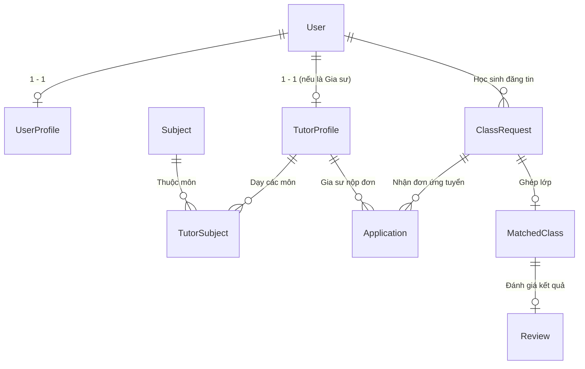

# 🎓 TutorLink – Nền Tảng Kết Nối Học Sinh Và Gia Sư Uy Tín Hàng Đầu

[](https://www.python.org/)
[](https://www.djangoproject.com/)
[](https://www.sqlite.org/)
[](https://getbootstrap.com/)
[](#chế-độ-giao-diện-sáng--tối-facebook-dark-mode)
[](#-kiểm-thử-hệ-thống-tự-động)

---

## 📌 1. Giới Thiệu Dự Án

**TutorLink** là hệ thống web hoàn chỉnh được xây dựng cho đồ án chuyên ngành Công nghệ Thông tin, nhằm giải quyết bài toán tìm kiếm và kết nối gia sư – học sinh một cách minh bạch, an toàn và bài bản.

Khác với việc đăng tin rời rạc trên mạng xã hội dễ bị trôi bài hoặc lừa đảo, TutorLink xây dựng một nền tảng **kết nối hai chiều thông minh**:
1. **Học sinh chủ động tìm gia sư**: Tìm kiếm, lọc theo môn học, khu vực (tỉnh thành, quận huyện), mức giá, hình thức học (Online / Offline), xem chi tiết hồ sơ đã kiểm duyệt và gửi yêu cầu học.
2. **Gia sư chủ động tìm lớp**: Học sinh đăng yêu cầu tìm gia sư; các gia sư phù hợp sẽ chủ động tìm lớp và gửi đơn ứng tuyển; học sinh duyệt ứng viên và hệ thống tự động ghép lớp.

---

## ✨ 2. Các Tính Năng Nổi Bật

### 🌗 Chế độ Giao diện Sáng / Tối (Facebook Dark Mode)
- Nút chuyển đổi nhanh **`[☀️ Sáng] [🌙 Tối]`** phong cách Segmented Control hiện đại trên thanh Menu.
- Chế độ tối chuẩn tone màu **Facebook** (`#18191A`, `#242526`, `#3A3B3C`) dịu mắt, chống mỏi mắt khi học tập và làm việc ban đêm.
- Tự động lưu lựa chọn của người dùng vào `localStorage`, không bị mất khi tải lại trang.

### 🔍 Bộ Lọc Tìm Kiếm Đa Chiều Nhanh Chóng
- Lọc theo **Môn học** (Toán, Vật lý, Hóa học, Ngữ văn, Tiếng Anh, Tin học, Luyện thi...).
- Lọc theo **Tỉnh / Thành phố** & **Quận / Huyện** (Hà Nội, TP. Hồ Chí Minh, Đà Nẵng, Hải Phòng...).
- Lọc theo **Hình thức dạy** (Dạy Online qua Google Meet/Zoom hoặc Gia sư dạy tại nhà).
- Lọc theo **Mức học phí** và **Đánh giá sao**.

### 👨‍🎓 Dành Cho Học Sinh (Student)
- Quản lý hồ sơ cá nhân và thông tin học tập.
- Đăng tin cần tìm gia sư với đầy đủ yêu cầu: môn học, lớp, thời gian rảnh, mức học phí đề xuất.
- Quản lý danh sách bài đăng: theo dõi trạng thái, xem danh sách gia sư nộp đơn ứng tuyển.
- Phê duyệt gia sư ➔ Hệ thống **tự động khởi tạo lớp học (Matched Class)**.
- Đánh giá chất lượng gia sư (cho điểm từ 1 - 5 sao và viết nhận xét chi tiết sau khi kết thúc lớp).

### 👨‍🏫 Dành Cho Gia Sư (Tutor)
- Hồ sơ gia sư chuẩn mực: Bằng cấp, chứng chỉ, chuyên môn, kinh nghiệm giảng dạy, trường đại học/ngành học.
- Đính kèm thẻ **"Đã kiểm duyệt hồ sơ"** sau khi Admin xét duyệt.
- Tìm kiếm danh sách lớp đang cần gia sư theo đúng chuyên môn và khu vực địa lý.
- Nộp đơn ứng tuyển vào lớp kèm lời nhắn giới thiệu bản thân và học phí mong muốn.
- Quản lý tiến độ các lớp đang dạy, đánh dấu hoàn thành lớp học.

### 🛡️ Dành Cho Quản Trị Viên (Admin Portal)
- Bảng điều khiển KPI tổng quan: Thống kê số lượng học sinh, gia sư, bài đăng, lớp đã ghép và doanh thu/học phí.
- Quản lý và duyệt hồ sơ gia sư: Xem thông tin chi tiết, bấm Duyệt hoặc Từ chối kèm lý do phản hồi.
- Quản lý bài đăng của học sinh: Kiểm duyệt nội dung, gỡ bỏ bài đăng vi phạm.
- Quản lý người dùng: Khóa/mở khóa tài khoản khi có dấu hiệu gian lận.
- Quản lý đánh giá & phản hồi: Đảm bảo đánh giá công tâm, trung thực.

---

## 🏗️ 3. Kiến Trúc Hệ Thống & Cấu Trúc Thư Mục

Dự án được tổ chức theo chuẩn kiến trúc module hóa của Django:

```text
Webgiasu/
├── manage.py                   # Lệnh điều khiển chính của Django
├── requirements.txt             # Danh sách thư viện phụ thuộc
├── db.sqlite3                  # Cơ sở dữ liệu SQLite
├── test_flows.py               # Bộ kiểm thử tự động toàn diện (15 bài test)
├── CHAY_TUTORLINK.bat          # File khởi động nhanh hệ thống bằng 1 click
│
├── config/                     # Cấu hình dự án (Settings, Routing, WSGI/ASGI)
│   ├── settings.py             # Cấu hình bảo mật, CSRF, apps, database
│   ├── urls.py                 # Định tuyến toàn bộ hệ thống
│   ├── asgi.py
│   └── wsgi.py
│
├── accounts/                   # Quản lý tài khoản & phân quyền người dùng
│   ├── models.py               # Model UserProfile (Role: student, tutor, admin)
│   ├── views.py                # Đăng ký, đăng nhập, phân luồng sau login
│   ├── urls.py
│   └── forms.py
│
├── tutors/                     # Hồ sơ gia sư & Môn học
│   ├── models.py               # Model TutorProfile, Subject, TutorSubject
│   ├── views.py                # Danh sách gia sư, lọc gia sư, chi tiết gia sư
│   └── urls.py
│
├── class_requests/             # Bài đăng tìm gia sư của học sinh
│   ├── models.py               # Model ClassRequest (Trạng thái: open, closed, matched)
│   ├── views.py                # Đăng tin, sửa tin, đóng tin, danh sách lớp
│   └── urls.py
│
├── applications/               # Đơn ứng tuyển nhận lớp của gia sư
│   ├── models.py               # Model Application (pending, accepted, rejected)
│   ├── views.py                # Nộp đơn, học sinh duyệt đơn
│   └── urls.py
│
├── matched_classes/            # Lớp học đã ghép thành công
│   ├── models.py               # Model MatchedClass (in_progress, completed, cancelled)
│   ├── views.py                # Quản lý lớp học đang diễn ra, hoàn thành lớp
│   └── urls.py
│
├── reviews/                    # Đánh giá & nhận xét chất lượng
│   ├── models.py               # Model Review (Rating 1-5 sao, nhận xét)
│   ├── views.py                # Tạo đánh giá, hiển thị đánh giá
│   └── urls.py
│
├── dashboard/                  # Trang điều khiển chuyên biệt theo vai trò
│   ├── views.py                # Student Dashboard, Tutor Dashboard, Admin Dashboard
│   └── urls.py
│
├── templates/                  # Giao diện HTML (Django Templates)
│   ├── base.html               # Layout chính tích hợp Theme Switcher
│   ├── home.html               # Trang chủ giới thiệu & tìm kiếm nhanh
│   ├── accounts/               # Giao diện đăng ký, đăng nhập
│   ├── tutors/                 # Giao diện danh sách & hồ sơ gia sư
│   ├── class_requests/         # Giao diện đăng tin & tìm lớp
│   ├── dashboard/              # Giao diện Dashboard Học sinh & Gia sư
│   └── admin_dashboard/        # Giao diện quản trị viên chuyên nghiệp
│
└── static/                     # Tài nguyên tĩnh (CSS, JS, hình ảnh)
    ├── css/style.css           # Design system, CSS variables, Facebook Dark Mode
    ├── js/main.js              # Xử lý giao diện, bộ lọc động, Dark mode toggle
    └── images/                 # Logo, banner, avatar mặc định
```

---

## 🗄️ 4. Thiết Kế Cơ Sở Dữ Liệu (Database Schema)

Hệ thống quản lý dữ liệu qua các bảng liên kết chặt chẽ:



### Các trạng thái cốt lõi:
- **Hồ sơ gia sư (`TutorProfile`)**: `pending` (Chờ duyệt) ➔ `approved` (Đã duyệt) / `rejected` (Từ chối).
- **Yêu cầu lớp học (`ClassRequest`)**: `open` (Đang tuyển) ➔ `matched` (Đã có gia sư) ➔ `closed` (Đã đóng).
- **Đơn ứng tuyển (`Application`)**: `pending` (Chờ học sinh duyệt) ➔ `accepted` (Chấp nhận) / `rejected` (Từ chối).
- **Lớp đã ghép (`MatchedClass`)**: `in_progress` (Đang học) ➔ `completed` (Hoàn thành) ➔ `cancelled` (Hủy lớp).

---

## 🚀 5. Hướng Dẫn Cài Đặt & Khởi Động Nhanh

### Yêu cầu môi trường:
- Hệ điều hành: Windows / macOS / Linux
- Python: Phiên bản **3.10 trở lên**

### Bước 1: Tải mã nguồn về máy
```bash
git clone <URL_REPOSITORY_CUA_BAN>
cd Webgiasu
```

### Bước 2: Cài đặt các thư viện cần thiết
```bash
pip install -r requirements.txt
```

### Bước 3: Khởi chạy website

#### 🌟 Cách 1: Nhanh nhất (Dành cho Windows)
Click đúp chuột vào file:
👉 **`CHAY_TUTORLINK.bat`**
- Hệ thống sẽ tự động kích hoạt máy chủ Django.
- Tự động mở trình duyệt web lên địa chỉ website.

#### 💻 Cách 2: Khởi chạy bằng dòng lệnh (Terminal / PowerShell)
```bash
python manage.py runserver 0.0.0.0:8000
```
Sau đó mở trình duyệt và truy cập:
- Trực tiếp trên máy: **`http://127.0.0.1:8000`** hoặc **`http://tutorlink.vn`**
- Truy cập từ máy khác cùng mạng Wi-Fi: **`http://192.168.0.203:8000`**

---

## 🔑 6. Danh Sách Tài Khoản Dùng Thử (Demo Accounts)

Hệ thống đã có sẵn dữ liệu mẫu đầy đủ cho tất cả các vai trò:

| Vai trò | Tên đăng nhập | Mật khẩu | Mục đích kiểm thử |
|---|---|---|---|
| **Quản trị viên (Admin)** | `admin` | `admin123` | Vào `/admin-dashboard/` xem thống kê, duyệt gia sư, quản lý bài đăng |
| **Học sinh (Student)** | `hocsinh1` | `123456` | Vào xem bài đã đăng, duyệt gia sư ứng tuyển, chấm 5 sao |
| **Gia sư Toán (Tutor)** | `giasu_toan` | `123456` | Xem danh sách lớp cần gia sư, nộp đơn ứng tuyển, quản lý lớp đang dạy |
| **Gia sư Tiếng Anh** | `giasu_anh` | `123456` | Xem hồ sơ gia sư môn Ngoại ngữ |
| **Gia sư Tin học** | `giasu_tin` | `123456` | Xem hồ sơ gia sư môn Công nghệ/Lập trình |
| **Gia sư Chờ duyệt** | `giasu_ly` | `123456` | Dùng để test tính năng Admin phê duyệt hồ sơ |

---

## 🧪 7. Kiểm Thử Hệ Thống Tự Động (Automated Testing)

Dự án đi kèm bộ kịch bản kiểm thử luồng tự động toàn diện [test_flows.py](file:///d:/Webgiasu/test_flows.py) mô phỏng chính xác hành vi người dùng thật.

Để chạy kiểm thử, mở Terminal tại thư mục dự án và chạy:
```bash
python test_flows.py
```

### Kết quả kiểm thử (15/15 bài test đạt 100%):
```text
=== BAT DAU KIEM THU TOAN BO HE THONG TUTORLINK ===
[PASS] 1. Trang chu (/) -> HTTP 200
[PASS] 2. Tim gia su (/tutors/) -> HTTP 200
[PASS] 3. Lop can gia su (/classes/) -> HTTP 200
[PASS] 4. Dashboard Hoc sinh (/student/dashboard/) -> HTTP 200
[PASS] 5. Bai dang cua toi (/student/posts/) -> HTTP 200
[PASS] 6. Lop hoc cua toi (/student/classes/) -> HTTP 200
[PASS] 7. Hoc sinh dang bai thanh cong (ID: 80)
[PASS] 8. Dashboard Gia su (/tutor/dashboard/) -> HTTP 200
[PASS] 9. Lop dang day (/tutor/classes/) -> HTTP 200
[PASS] 10. Gia su ung tuyen thanh cong vao lop 80
[PASS] 11. Hoc sinh chap nhan ung vien -> Tu dong ghep lop (ID: 53)
[PASS] 12. Danh dau hoan thanh lop hoc (ID: 53)
[PASS] 13. Hoc sinh danh gia 5 sao cho gia su thanh cong
[PASS] 14. Toan bo 7 trang Quan tri vien (Admin) -> HTTP 200
[PASS] 15. Admin phe duyet ho so gia su cho thanh cong

=== TAT CA 15/15 BAI KIEM THU LUONG DA THANH CONG 100%! ===
```

---

## 👥 8. Thành Viên Nhóm & Phân Công Nhiệm Vụ

| STT | Thành viên | Phụ trách chính | Chi tiết công việc |
|:---:|---|---|---|
| 1 | **Thành viên 1** | Trưởng nhóm & Hệ thống chung | Thiết kế cơ sở dữ liệu, quản lý kiến trúc Django, cấu hình bảo mật & phân quyền |
| 2 | **Thành viên 2** | Module Học sinh (Student) | Giao diện đăng bài, tìm kiếm gia sư, bộ lọc môn học/quận huyện, xem hồ sơ ứng viên |
| 3 | **Thành viên 3** | Module Gia sư (Tutor) | Hồ sơ gia sư chuyên nghiệp, tìm kiếm lớp học, quy trình gửi đơn ứng tuyển |
| 4 | **Thành viên 4** | Ghép lớp & Đánh giá (Matching & Review) | Logic tự động ghép lớp, quản lý tiến độ lớp học, chức năng chấm điểm & nhận xét 5 sao |
| 5 | **Thành viên 5** | Quản trị viên (Admin) & Giao diện | Dashboard thống kê, quy trình duyệt hồ sơ gia sư, Dark Mode Facebook, kiểm thử hệ thống |

---

## 📄 9. Bản Quyền & Giấy Phép

Dự án được xây dựng phục vụ mục đích học tập và làm đồ án tốt nghiệp / môn học Lập trình Web.  
Mọi thắc mắc hoặc đóng góp vui lòng liên hệ nhóm phát triển qua email hỗ trợ của dự án: `contact@tutorlink.edu.vn`.
