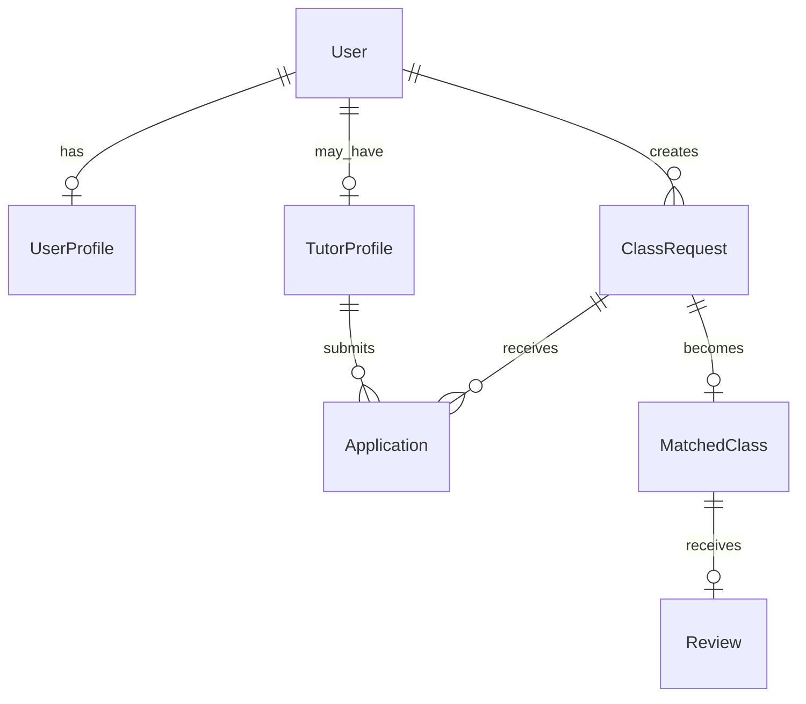

# 🎓 TutorLink

**TutorLink** là nền tảng web kết nối **Phụ huynh/Học sinh – Gia sư – Quản trị viên**, được xây dựng bằng **Django** cho bài tập/dự án môn Lập trình Web.

> Mục tiêu của hệ thống là hỗ trợ phụ huynh/học sinh tìm gia sư phù hợp, giúp gia sư tìm lớp và tạo một quy trình quản lý – xét duyệt – ghép lớp rõ ràng trên cùng một nền tảng.

---

## 🌐 Website Online

**Live demo:** https://tutorlink-psi.vercel.app/

Website được triển khai trên **Vercel**, vì vậy có thể truy cập trực tuyến mà không cần máy phát triển phải bật.

---

## ✨ Chức năng chính

### 👨‍👩‍👧 Dành cho Phụ huynh / Học sinh

- Đăng ký và đăng nhập tài khoản.
- Cập nhật hồ sơ cá nhân.
- Tìm kiếm gia sư.
- Lọc gia sư theo môn học, khu vực và hình thức học.
- Xem hồ sơ chi tiết của gia sư.
- Đăng yêu cầu tìm gia sư.
- Quản lý các bài đăng đã tạo.
- Xem danh sách gia sư ứng tuyển.
- Chấp nhận hoặc từ chối gia sư.
- Theo dõi các lớp đã ghép.
- Đánh giá gia sư sau quá trình học.
- Nhận thông báo từ hệ thống.

### 👨‍🏫 Dành cho Gia sư

- Đăng ký tài khoản gia sư.
- Xây dựng và cập nhật hồ sơ gia sư.
- Khai báo chuyên môn, môn học, kinh nghiệm và thông tin cá nhân.
- Tìm kiếm các lớp đang cần gia sư.
- Gửi đơn ứng tuyển nhận lớp.
- Theo dõi trạng thái đơn ứng tuyển.
- Nhận yêu cầu học từ học sinh/phụ huynh.
- Quản lý các lớp đang dạy.
- Nhận thông báo từ hệ thống.

### 🛡️ Dành cho Quản trị viên

- Dashboard quản trị riêng.
- Theo dõi tổng quan dữ liệu hệ thống.
- Quản lý người dùng.
- Khóa / mở khóa tài khoản.
- Xem và kiểm duyệt hồ sơ gia sư.
- Duyệt hoặc từ chối gia sư.
- Quản lý bài đăng tìm gia sư.
- Quản lý dữ liệu và hoạt động chính của hệ thống.
- Có quyền truy cập Django Admin.

---

## 🔄 Quy trình hoạt động

### Luồng 1: Học sinh tìm gia sư

```text
Học sinh/Phụ huynh
        ↓
Tìm kiếm gia sư
        ↓
Xem hồ sơ chi tiết
        ↓
Gửi yêu cầu học
        ↓
Gia sư tiếp nhận
        ↓
Ghép lớp
        ↓
Học tập
        ↓
Đánh giá
```

### Luồng 2: Gia sư tìm lớp

```text
Học sinh đăng lớp
        ↓
Gia sư tìm lớp
        ↓
Gia sư ứng tuyển
        ↓
Học sinh xem ứng viên
        ↓
Chấp nhận gia sư
        ↓
Hệ thống ghép lớp
```

### Luồng 3: Quản trị viên

```text
Gia sư đăng ký
        ↓
Hồ sơ chờ duyệt
        ↓
Admin kiểm tra
        ↓
Duyệt / Từ chối
        ↓
Gia sư được phép hoạt động
```

---

## 🛠 Công nghệ sử dụng

| Thành phần | Công nghệ |
|---|---|
| Backend | Python, Django |
| Frontend | HTML, CSS, JavaScript, Bootstrap |
| Template Engine | Django Templates |
| Database local | SQLite |
| Database production | PostgreSQL (Neon) |
| Lưu trữ ảnh production | Cloudinary |
| Deployment | Vercel |
| Version Control | Git & GitHub |

---

## 🏗 Cấu trúc dự án

```text
TutorLink/
│
├── accounts/             # Tài khoản, đăng nhập, đăng ký, hồ sơ, thông báo
├── applications/         # Đơn ứng tuyển nhận lớp
├── class_requests/       # Bài đăng / yêu cầu tìm gia sư
├── config/               # Cấu hình Django, URL, WSGI/ASGI
├── dashboard/            # Dashboard Student / Tutor / Admin
├── matched_classes/      # Quản lý lớp đã ghép
├── reviews/              # Đánh giá gia sư
├── study_requests/       # Yêu cầu học
├── tutors/               # Hồ sơ và chức năng của gia sư
├── templates/            # Giao diện HTML
├── static/               # CSS, JavaScript, hình ảnh tĩnh
├── media/                # File media khi chạy local
│
├── manage.py
├── requirements.txt
├── pyproject.toml
├── build.sh
└── README.md
```

---

## 🗃 Mô hình dữ liệu tổng quát



Một số trạng thái quan trọng:

- **Tutor Profile:** pending → approved / rejected
- **Application:** pending → accepted / rejected
- **Class Request:** open → matched / closed
- **Matched Class:** in progress → completed / cancelled

---

## 🚀 Chạy project trên máy

### 1. Clone repository

```bash
git clone https://github.com/thuahoang09-dot/TutorLink.git
cd TutorLink
```

### 2. Tạo virtual environment

**macOS / Linux**

```bash
python3 -m venv .venv
source .venv/bin/activate
```

**Windows**

```bash
python -m venv .venv
.venv\Scripts\activate
```

### 3. Cài thư viện

```bash
pip install -r requirements.txt
```

### 4. Tạo database

```bash
python manage.py migrate
```

### 5. Chạy server

```bash
python manage.py runserver
```

Sau đó mở:

```text
http://127.0.0.1:8000/
```

---

## ☁️ Triển khai Production

Phiên bản production sử dụng:

- **Vercel** để triển khai ứng dụng.
- **Neon PostgreSQL** để lưu dữ liệu online.
- **Cloudinary** để lưu hình ảnh.
- Environment Variables trên Vercel để cấu hình database, media và tài khoản quản trị.

Một số biến môi trường được sử dụng:

```text
DATABASE_URL
CLOUDINARY_URL
ADMIN_USERNAME
ADMIN_PASSWORD
```

> Giá trị thật của các biến môi trường được cấu hình trực tiếp trên nền tảng deployment và không cần ghi trong README.

---

## 👤 Phân quyền người dùng

TutorLink có 3 nhóm người dùng:

| Vai trò | Quyền chính |
|---|---|
| Student / Parent | Tìm gia sư, đăng lớp, chọn gia sư, quản lý lớp, đánh giá |
| Tutor | Quản lý hồ sơ, tìm lớp, ứng tuyển, quản lý lớp |
| Admin | Kiểm duyệt, quản lý tài khoản, bài đăng, gia sư và hệ thống |

Sau khi đăng nhập, hệ thống tự động điều hướng người dùng tới dashboard phù hợp với vai trò.

---

## 📱 Giao diện

Website được thiết kế theo hướng:

- Responsive trên nhiều kích thước màn hình.
- Giao diện trực quan, dễ thao tác.
- Navigation riêng theo chức năng.
- Form đăng nhập / đăng ký.
- Dashboard theo từng vai trò.
- Tìm kiếm và lọc dữ liệu.
- Thông báo hệ thống.
- Upload và hiển thị ảnh đại diện.

---

## 📌 Repository

Repository này chứa mã nguồn của dự án TutorLink phục vụ mục đích học tập và nộp bài môn **Lập trình Web**.

**GitHub:** https://github.com/thuahoang09-dot/TutorLink

---

## 📄 License

Dự án được thực hiện cho mục đích học tập.
